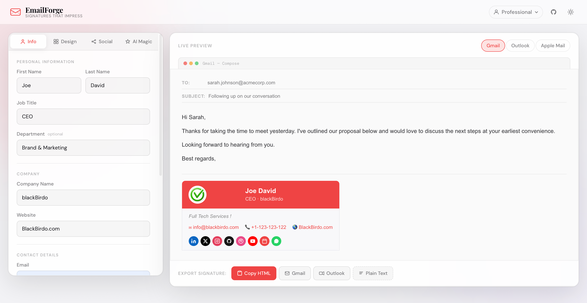

# EmailForge ✦

**The Most Elegant & Intelligent HTML Email Signature Builder**

## ✨ Preview



*Elegant and professional email signature generated with EmailForge*

> Signatures That Impress — free, open source, and entirely client-side.

[](LICENSE)


---

## ✦ What is EmailForge?

EmailForge is a premium, browser-based email signature builder designed to rival paid tools like WiseStamp and Newoldstamp — completely free, with no account required and no data ever leaving your browser.

It combines a beautiful, luxurious design system with an intelligent AI-style auto-fill feature that generates a complete, polished professional signature from just three fields: **name**, **title**, and **company**.

---

## ✨ Features

| Feature | Description |
|---|---|
| **AI Signature Builder** | Enter name, title & company → get a complete signature instantly |
| **6 Premium Templates** | Minimal, Executive, Modern, Creative, Corporate, Luxury |
| **Live Preview** | Real-time rendering in Gmail, Outlook & Apple Mail modes |
| **Custom Accent Colors** | 10 presets + custom color picker, updates entire UI instantly |
| **Multiple Profiles** | Save, switch, and rename unlimited signature profiles |
| **Smart Export** | Copy HTML, Gmail-optimised, Outlook-optimised, or Plain Text |
| **Auto-Save** | All data persisted to `localStorage` — never lose your work |
| **Dark / Light Mode** | Elegant dark mode by default with smooth toggle |
| **Fully Responsive** | Mobile-first, works on any screen size |
| **100% Client-Side** | No server, no account, no tracking |

---

## 🚀 Quick Start

1. **Clone the repo**
   ```bash
   git clone https://github.com/ICodingStack/EmailForge.git
   cd EmailForge
   ```

2. **Open in browser**
   ```bash
   # No build step required — just open index.html
   open index.html

   # Or serve locally for best experience:
   npx serve .
   # or
   python3 -m http.server 3000
   ```

3. **That's it.** No npm install, no bundler, no configuration.

---

## 📁 Project Structure

```
emailforge/
├── index.html                  # Main application shell
├── css/
│   └── style.css               # Premium design system (CSS variables + components)
├── js/
│   ├── main.js                 # App orchestrator & state management
│   ├── signature-generator.js  # 6 template renderers → inline-CSS HTML output
│   ├── ai-signature-builder.js # Intelligent auto-fill from minimal input
│   ├── preview-renderer.js     # Live preview, client switching, color propagation
│   ├── copy-utils.js           # Gmail / Outlook / HTML / plain-text export
│   └── utils.js                # Shared helpers (debounce, storage, clipboard, etc.)
├── assets/
│   └── icons/                  # SVG icon assets (if extended)
├── README.md
├── LICENSE
└── .gitignore
```

---

## 🎨 Templates

| Template | Best For |
|---|---|
| **Minimal** | Clean, distraction-free, suits any industry |
| **Executive** | Bold left-border accent, high-authority feel |
| **Modern** | Colored header banner, great for startups |
| **Creative** | Full-bleed accent block, bold & expressive |
| **Corporate** | Classic multi-line layout, enterprise-ready |
| **Luxury** | Gold-accent borders, refined & prestigious |

---

## 🤖 AI Signature Builder

The AI Magic tab lets you generate a complete signature in seconds:

1. Enter your **Full Name**, **Job Title**, and **Company**
2. Choose a **tone** (Executive, Creative, Minimal, Warm, Technical)
3. Click **Generate My Signature**

EmailForge will intelligently:
- Generate a professional email address and website URL
- Create a realistic phone number placeholder
- Write a tailored personal tagline
- Infer social media handles
- Select the best-fitting template and accent color

Everything is editable after generation.

---

## 📋 How to Install Your Signature

### Gmail
1. Click **Gmail** button → copies rich HTML to clipboard
2. Open Gmail → Settings (⚙) → See all settings → General → Signature
3. Create new signature → Paste with `Ctrl+V` / `Cmd+V`

### Outlook
1. Click **Outlook** button → copies Outlook-optimised HTML
2. Open Outlook → File → Options → Mail → Signatures
3. New → Paste the HTML

### Apple Mail
1. Click **Copy HTML** → use the source code
2. Apple Mail → Preferences → Signatures → New
3. Drag the HTML file into the signature composer

---

## 🛠 Customisation

EmailForge uses CSS custom properties (`--accent`, `--bg`, etc.) for theming. You can extend the design by modifying `css/style.css`.

To add a new template, add a renderer function in `signature-generator.js` and register it in the `TEMPLATES` object and `generate()` switch statement.

---

## 🔒 Privacy

EmailForge stores all data locally in your browser's `localStorage`. No data is ever sent to any server. The only external requests are for Google Fonts and Tailwind CSS CDN.

---

## 📄 License

MIT © EmailForge Contributors — see [LICENSE](LICENSE) for details.

---

## 🙏 Built With

- [Tailwind CSS](https://tailwindcss.com) — utility-first CSS framework
- [Google Fonts](https://fonts.google.com) — Playfair Display + DM Sans
- Pure Vanilla JavaScript — no framework dependencies

---

**Made with love ❤️ by [BlackBirdo](https://blackbirdo.com)**
